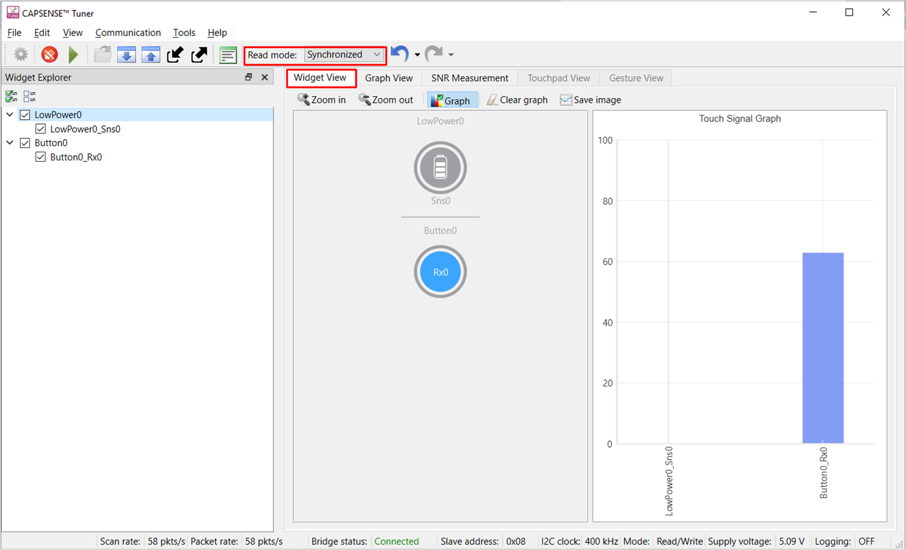
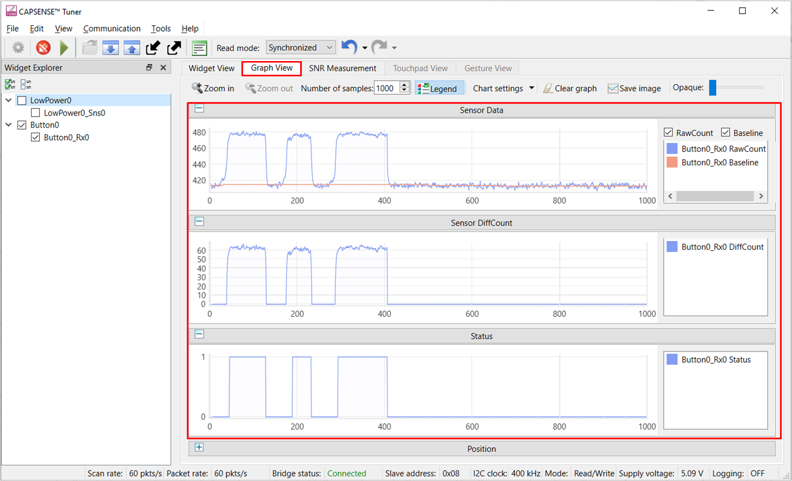
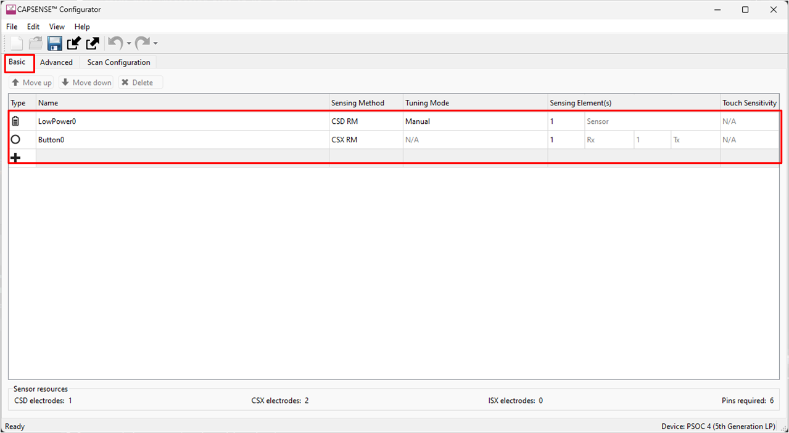
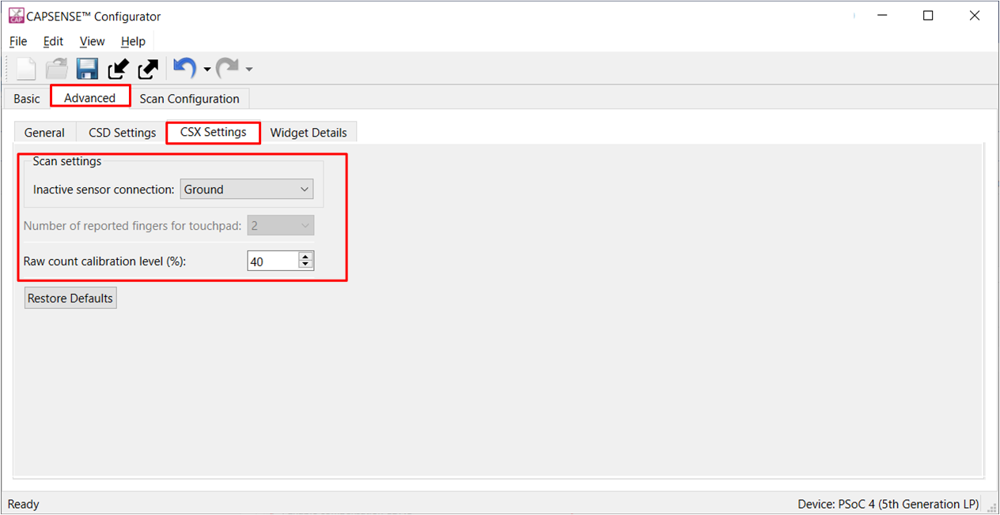
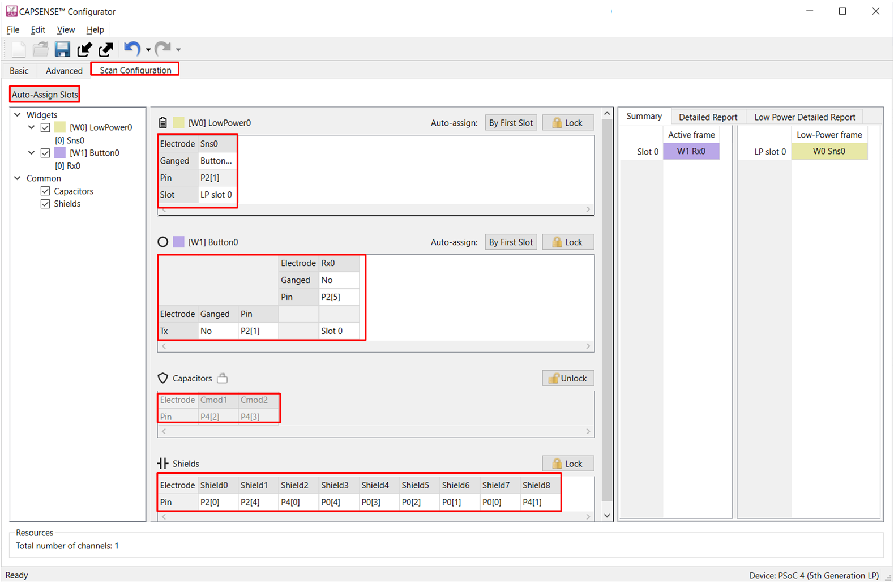
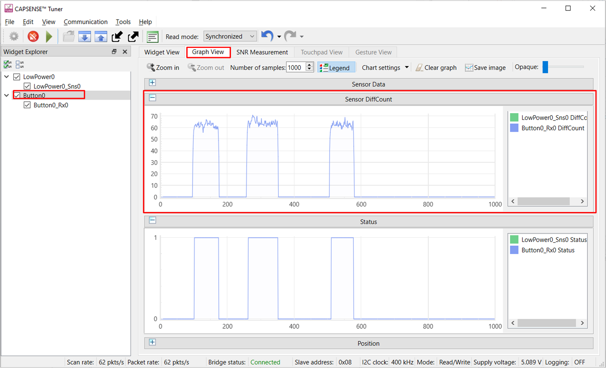
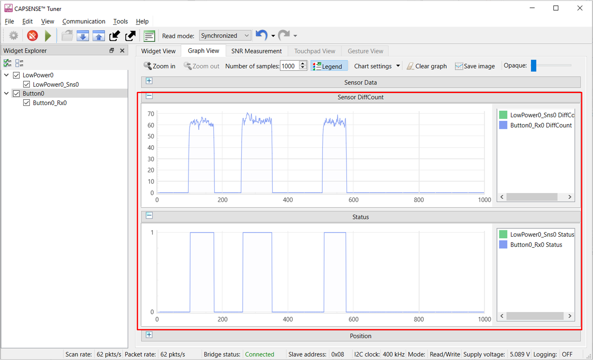
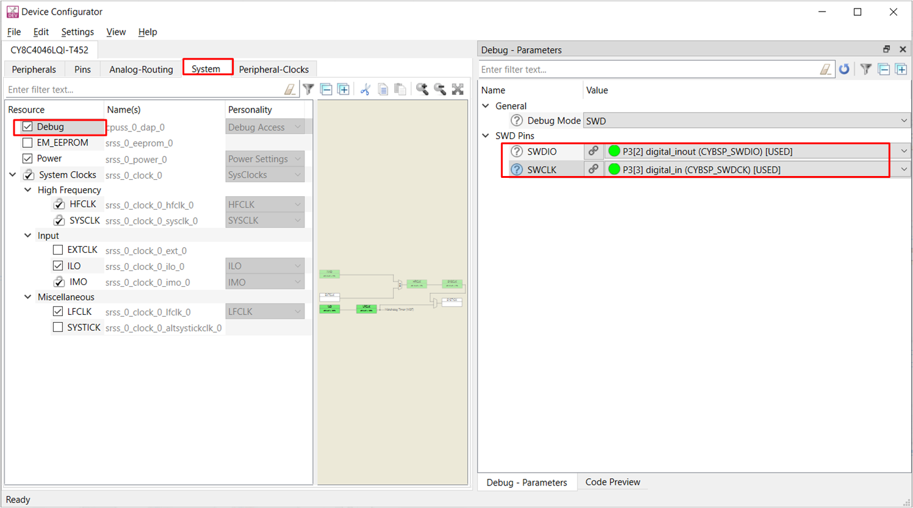

# PSOC&trade; 4: MSCLP low-power mutual-capacitance button

This code example demonstrates the implementation of low power CSX button application to detect a finger touch on a mutual-capacitance based button widget in PSOC&trade;4 devices. This example uses a 5th generation CAPSENSE&trade; multi-sense converter low-power (MSCLP).
This code example also explains how to manually tune the mutual-capacitance-based button for optimum performance with respect to parameters such as reliability, power consumption, and response time using the CSX-RM sensing technique and CAPSENSE&trade; Tuner GUI. Here, CSX represents the mutual-capacitance sensing technique, and RM represents the ratio metric method.

[View this README on GitHub.](https://github.com/Infineon/mtb-example-psoc4-msclp-low-power-csx-button)

[Provide feedback on this code example.](https://cypress.co1.qualtrics.com/jfe/form/SV_1NTns53sK2yiljn?Q_EED=eyJVbmlxdWUgRG9jIElkIjoiQ0UyMzg4MjAiLCJTcGVjIE51bWJlciI6IjAwMi0zODgyMCIsIkRvYyBUaXRsZSI6IlBTT0MmdHJhZGU7IDQ6IE1TQ0xQIGxvdy1wb3dlciBtdXR1YWwtY2FwYWNpdGFuY2UgYnV0dG9uIiwicmlkIjoibHVja3kiLCJEb2MgdmVyc2lvbiI6IjQuMC4wIiwiRG9jIExhbmd1YWdlIjoiRW5nbGlzaCIsIkRvYyBEaXZpc2lvbiI6Ik1DRCIsIkRvYyBCVSI6IklDVyIsIkRvYyBGYW1pbHkiOiJQU09DIn0=)

## Requirements

- [ModusToolbox&trade;](https://www.infineon.com/cms/en/design-support/tools/sdk/modustoolbox-software/) v3.5 or later

 > **Note:** This code example version requires ModusToolbox&trade; version 3.5 or later and is not backward compatible with older versions.

- Board support package (BSP) minimum required version: 3.3.0
- Programming language: C
- Associated parts: [PSOC&trade; 4000T](https://www.infineon.com/002-33949), [PSOC&trade; 4100T Plus](https://www.infineon.com/002-39671)


## Supported toolchains (make variable 'TOOLCHAIN')

- GNU Arm&reg; Embedded Compiler v11.3.1 (`GCC_ARM`) – Default value of `TOOLCHAIN`
- Arm&reg; Compiler v6.22 (`ARM`)
- IAR C/C++ Compiler v9.50.2 (`IAR`)


## Supported kits (make variable 'TARGET')

- [PSOC&trade; 4000T CAPSENSE&trade; Prototyping Kit](https://www.infineon.com/CY8CPROTO-040T) (`CY8CPROTO-040T`) - Default `TARGET`
- [PSOC&trade; 4100T Plus CAPSENSE&trade; Prototyping Kit](https://www.infineon.com/CY8CPROTO-041TP) (`CY8CPROTO-041TP`)


## Hardware setup

This example uses the board's default configuration. 

 See the kit user guide to configure the required operating voltage and to setup the VDDA supply voltage refer to section [Set up the VDDA supply voltage and debug mode in Device Configurator](#set-up-the-vdda-supply-voltage-and-debug-mode-in-device-configurator).

This application is tuned to perform optimally at the default voltage. However, you can observe the basic functionality at other supported voltages.

**Table 1. Kit User guide and supported voltages**

Kit | User guide  | 1.8 V | 3.3 V | 5 V
:-------- |:----------- |:----------- |:----- |:-----
CY8CPROTO-040T| [CY8CPROTO-040T PSOC&trade; 4000T CAPSENSE&trade; Prototyping Kit guide](https://www.infineon.com/002-38600)  | Yes|Yes|Yes*
CY8CPROTO-041TP| [CY8CPROTO-041TP PSOC&trade; 4100T Plus CAPSENSE&trade; Prototyping Kit guide](https://www.infineon.com/002-40273) | Yes|Yes|Yes*

   Yes* - Kit default operating voltage


## Software setup

See the [ModusToolbox&trade; tools package installation guide](https://www.infineon.com/ModusToolboxInstallguide) for information about installing and configuring the tools package.


This example requires no additional software or tools.


## Using the code example


### Create the project

The ModusToolbox&trade; tools package provides the Project Creator as both a GUI tool and a command line tool.

<details><summary><b>Use Project Creator GUI</b></summary>

1. Open the Project Creator GUI tool.

   There are several ways to do this, including launching it from the dashboard or from inside the Eclipse IDE. For more details, see the [Project Creator user guide](https://www.infineon.com/ModusToolboxProjectCreator) (locally available at *{ModusToolbox&trade; install directory}/tools_{version}/project-creator/docs/project-creator.pdf*).

2. On the **Choose Board Support Package (BSP)** page, select a kit supported by this code example. See [Supported kits](#supported-kits-make-variable-target).

   > **Note:** To use this code example for a kit not listed here, you may need to update the source files. If the kit does not have the required resources, the application may not work.

3. On the **Select Application** page:

   a. Select the **Applications(s) Root Path** and the **Target IDE**.

   > **Note:** Depending on how you open the Project Creator tool, these fields may be pre-selected for you.

   b. Select this code example from the list by enabling its check box.

   > **Note:** You can narrow the list of displayed examples by typing in the filter box.

   c. (Optional) Change the suggested **New Application Name** and **New BSP Name**.

   d. Click **Create** to complete the application creation process.

</details>


<details><summary><b>Use Project Creator CLI</b></summary>

The 'project-creator-cli' tool can be used to create applications from a CLI terminal or from within batch files or shell scripts. This tool is available in the *{ModusToolbox&trade; install directory}/tools_{version}/project-creator/* directory.

Use a CLI terminal to invoke the 'project-creator-cli' tool. On Windows, use the command-line 'modus-shell' program provided in the ModusToolbox&trade; installation instead of a standard Windows command-line application. This shell provides access to all ModusToolbox&trade; tools. You can access it by typing "modus-shell" in the search box in the Windows menu. In Linux and macOS, you can use any terminal application.

The following example clones the "MSCLP low-power CSX button tuning" application with the desired name "MSCLPMutualCapButtonTuning" configured for the *CY8CPROTO-040T* BSP into the specified working directory, *C:/mtb_projects*:

   ```
   project-creator-cli --board-id CY8CPROTO-040T --app-id mtb-example-psoc4-msclp-low-power-csx-button --user-app-name MSCLPMutualCapButtonTuning --target-dir "C:/mtb_projects"
   ```


The 'project-creator-cli' tool has the following arguments:

Argument | Description | Required/optional
---------|-------------|-----------
`--board-id` | Defined in the <id> field of the [BSP](https://github.com/Infineon?q=bsp-manifest&type=&language=&sort=) manifest | Required
`--app-id`   | Defined in the <id> field of the [CE](https://github.com/Infineon?q=ce-manifest&type=&language=&sort=) manifest | Required
`--target-dir`| Specify the directory in which the application is to be created if you prefer not to use the default current working directory | Optional
`--user-app-name`| Specify the name of the application if you prefer to have a name other than the example's default name | Optional

<br>

> **Note:** The project-creator-cli tool uses the `git clone` and `make getlibs` commands to fetch the repository and import the required libraries. For details, see the "Project creator tools" section of the [ModusToolbox&trade; tools package user guide](https://www.infineon.com/ModusToolboxUserGuide) (locally available at {ModusToolbox&trade; install directory}/docs_{version}/mtb_user_guide.pdf).

</details>


### Open the project

After the project has been created, you can open it in your preferred development environment.


<details><summary><b>Eclipse IDE</b></summary>

If you opened the Project Creator tool from the included Eclipse IDE, the project will open in Eclipse automatically.

For more details, see the [Eclipse IDE for ModusToolbox&trade; user guide](https://www.infineon.com/MTBEclipseIDEUserGuide) (locally available at *{ModusToolbox&trade; install directory}/docs_{version}/mt_ide_user_guide.pdf*).

</details>


<details><summary><b>Visual Studio (VS) Code</b></summary>

Launch VS Code manually, and then open the generated *{project-name}.code-workspace* file located in the project directory.

For more details, see the [Visual Studio Code for ModusToolbox&trade; user guide](https://www.infineon.com/MTBVSCodeUserGuide) (locally available at *{ModusToolbox&trade; install directory}/docs_{version}/mt_vscode_user_guide.pdf*).

</details>


<details><summary><b>Keil µVision</b></summary>

Double-click the generated *{project-name}.cprj* file to launch the Keil µVision IDE.

For more details, see the [Keil µVision for ModusToolbox&trade; user guide](https://www.infineon.com/MTBuVisionUserGuide) (locally available at *{ModusToolbox&trade; install directory}/docs_{version}/mt_uvision_user_guide.pdf*).

</details>


<details><summary><b>IAR Embedded Workbench</b></summary>

Open IAR Embedded Workbench manually, and create a new project. Then select the generated *{project-name}.ipcf* file located in the project directory.

For more details, see the [IAR Embedded Workbench for ModusToolbox&trade; user guide](https://www.infineon.com/MTBIARUserGuide) (locally available at *{ModusToolbox&trade; install directory}/docs_{version}/mt_iar_user_guide.pdf*).

</details>


<details><summary><b>Command line</b></summary>

If you prefer to use the CLI, open the appropriate terminal, and navigate to the project directory. On Windows, use the command-line 'modus-shell' program; on Linux and macOS, you can use any terminal application. From there, you can run various `make` commands.

For more details, see the [ModusToolbox&trade; tools package user guide](https://www.infineon.com/ModusToolboxUserGuide) (locally available at *{ModusToolbox&trade; install directory}/docs_{version}/mtb_user_guide.pdf*).

</details>


## Operation


1. Connect the board to your PC using a USB cable through the KitProg3 USB connector.


2. Program the board using one of the following:

   <details><summary><b>Using Eclipse IDE</b></summary>

      1. Select the application project in the Project Explorer.

      2. In the **Quick Panel**, scroll down, and click **\<Application Name> Program (KitProg3_MiniProg4)**.
   </details>


   <details><summary><b>In other IDEs</b></summary>

   Follow the instructions in your preferred IDE.
   </details>


   <details><summary><b>Using CLI</b></summary>

     From the terminal, execute the `make program` command to build and program the application using the default toolchain to the default target. The default toolchain is specified in the application's Makefile but you can override this value manually:
      ```
      make program TOOLCHAIN=<toolchain>
      ```

      Example:
      ```
      make program TOOLCHAIN=GCC_ARM
      ```
   </details>

3. After programming, the application starts automatically.

   > **Note:** After programming, you may see the following error message if debug mode is disabled, see Table 13 for the default debug configuration in the supported kits. Ignore the error or enable the debug mode to solve this error.

   ``` c
   "Error: Error connecting Dp: Cannot read IDR"
   ```

4. To test the application, place your finger over the CAPSENSE&trade; CSX button and notice that the LED turns ON when touched and turns OFF when the finger is lifted. For LED numbers refer **Table 2**

   **Table 2. LED indications**

   Scenario  | CY8CPROTO-040T | CY8CPROTO-041TP 
   :------------------| :-----| :-----
   Touch  | LED3 | LED3 
   
   <br> 

5. You can also monitor the CAPSENSE&trade; data using the CAPSENSE&trade; tuner application as follows:

    **Monitor data using CAPSENSE&trade; Tuner**
    
    1. Open CAPSENSE&trade; Tuner from the **BSP Configurator** section in the IDE **Quick Panel**. 
    
        You can also run the CAPSENSE&trade; tuner application standalone from *{ModusToolbox&trade; install directory}/ModusToolbox/tools_{version}/capsense-configurator/capsense-tuner*. In this case, after opening the application, select **File** > **Open** and open the *design.cycapsense* file of the respective application, which is present in the *{Application root directory}/bsps/TARGET_APP_\<BSP-NAME>/config/* folder. 

	     See the [ModusToolbox&trade; user guide](https://www.infineon.com/ModusToolboxUserGuide) (locally available at *ModusToolbox&trade; install directory/docs_{version}/mtb_user_guide.pdf*) for options to open the CAPSENSE&trade; tuner application using the CLI.

    2. Ensure that the kit is in **CMSIS-DAP Bulk mode** (KitProg3 status LED is ON and not blinking). See [Firmware-loader](https://github.com/Infineon/Firmware-loader) to learn how to update the firmware and switch modes in KitProg3.
  
    3. In the tuner application, click on the **Tuner Communication Setup** icon or select **Tools** > **Tuner Communication Setup**. In the window, select the I2C checkbox under KitProg3 and configure as shown in **Figure 1**.

       - **I2C address:** 8
       - **Sub-address:** 2 bytes
       - **Speed (kHz):** 400

        These are the same values set in the EZI2C resource.

        **Figure 1. Tuner Communication Setup parameters**

       


    4. Click **Connect** or select **Communication** > **Connect** to establish a connection as shown in **Figure 2**.

       **Figure 2. Establish connection**

        

    5. Click **Start** or select **Communication** > **Start** to start data streaming from the device.

         **Figure 3. Start Tuner communication**

         

         The **Widget/Sensor parameters** tab gets updated with the parameters configured in the **CAPSENSE&trade; Configurator** window. The tuner displays the data from the sensor in the **Widget View** and **Graph View** tabs.

         <br>

    6. Set the **Read mode** to **Synchronized** mode. Navigate to the **Widget View** tab, and you can see the **Button0** widget highlighted in **blue** when you touch it as shown in **Figure 4**.

       **Figure 4. Widget View of the CAPSENSE&trade; Tuner**

         

    7. You can view the raw count, baseline, difference count, and status for each sensor in the **Graph View** tab. For example, to view the sensor data for Button0, select **Button0_Rx0** under **Button0**.

       **Figure 5. Graph View for the CAPSENSE&trade; Tuner**

       

    8. Observe the **Widget/Sensor parameters** section in the CAPSENSE&trade; Tuner window as shown in **Figure 5**.
      
    9. Switch to the **SNR Measurement** tab for measuring the SNR, verify that the SNR is greater than 5:1 and the signal count is above 50, select the **Button0** and **Button0_Rx0** sensors, and then click **Acquire Noise** as shown in **Figure 6**.

       **Figure 6. CAPSENSE&trade; Tuner – SNR measurement: Acquire noise**

       

    10. Once the noise is acquired, place the metal finger (6 mm finger is used in this example) at a position on the button and then click **Acquire Signal**. Ensure that the metal finger remains on the button as long as the signal acquisition is in progress. Observe that the SNR is above 5:1 and the signal count is above 50.

        The calculated SNR on this button is displayed as shown in **Figure 7**. Based on your end- system design, test the signal with a finger that matches the size of your normal use case. Typically, finger-size targets are ~4 to 8 mm. Consider testing with smaller sizes that should be rejected by the system to ensure that they do not reach the finger threshold.

        **Figure 7. CAPSENSE&trade; Tuner - SNR measurement: Acquire signal**

        

        > **Note:** Refer to the [PSOC&trade; 4: MSCLP low-power CSD button](https://github.com/Infineon/mtb-example-psoc4-msclp-low-power-csd-button) to observe the power state transitions indicated by changing the blinking rate of a LED, Measure current at different power modes section, The Code Example also explains the scan time and process time measurements it also describes the steps of current measurement at different power modes.


</details>

<br>

## Measure current at different power modes

> **Note:** Refer to the [PSOC&trade; 4: MSCLP low-power CSD button](https://github.com/Infineon/mtb-example-psoc4-msclp-low-power-csd-button) to observe the power state transitions, Measure current at different power modes section, The Code Example also explains the scan time and process time measurements.

   **Table 3. Measured current for different modes**

   Power mode | Refresh rate (Hz) | Current consumption (µA)  <br>(CY8CPROTO-040T) | Current consumption (µA) <br>(CY8CPROTO-041TP)
   ---------|-------------|-----------|-----------
   Active    |128    | 66 | 98
   Active low-refresh rate <br>(ALR)  |32 | 18 | 28
   Wake-on-Touch <br>(WoT)  |16 | 3.0 | 6.3


   <br>

   **Table 4. Deep Sleep current of different kits**
  
   Parameter | CY8CPROTO-040T (µA)| CY8CPROTO-041TP (µA)
   :-------- |:-----------: |:-----------:
   Deep Sleep |  1.7  |  2.3 

   <br>

> **Note:** The WoT current as indicated in Table 5 was measured on a kit with the Deep Sleep current mentioned in Table 6. If the kit has a Deep Sleep current of 2.5 µA (typical), the WoT current is expected to be higher.


## Tuning procedure

<details><summary><b> Create a custom BSP for your board </b></summary>

1. Create a custom BSP for your board having any device, by following the steps given in [ModusToolbox&trade; BSP Assistant user guide](https://www.infineon.com/ModusToolboxBSPAssistant).

2. Open the *design.modus* file from the *{Application root directory}/bsps/TARGET_APP_\<BSP-NAME>/config/* folder obtained in the previous step and enable CAPSENSE&trade; to get the *design.cycapsense* file. CAPSENSE&trade; configuration can then be started from scratch as explained below.


</details>

The following steps explain the tuning procedure as shown in **Figure 8**. 

> **Note:** See the section "Selecting CAPSENSE&trade; hardware parameters" in the [PSOC&trade; 4 and PSOC&trade; 6 MCU CAPSENSE&trade; design guides](https://www.infineon.com/AN85951) to learn about the considerations for selecting each parameter value.

**Figure 8. CSD button widget tuning flow**  


Do the following to tune the button widget:

- [Stage 1: Set the initial hardware parameters](#stage-1-set-the-initial-hardware-parameters)

- [Stage 2: Set the sense clock frequency](#stage-2-set-the-sense-clock-frequency)

- [Stage 3: Fine-tune for required SNR and refresh rate](#stage-3-fine-tune-for-required-snr-and-refresh-rate)

- [Stage 4: Tune the threshold parameters](#stage-4-tune-the-threshold-parameters)


### Stage 1: Set the initial hardware parameters
---------

1. Connect the board to your PC using a USB cable through the KitProg3 USB connector.
2. Launch the device configurator tool.

    Launch the device configurator in Eclipse IDE for ModusToolbox&trade; from the **BSP Configurator** section in the IDE **Quick Panel** or in Standalone mode from *{ModusToolbox&trade; install directory}/ModusToolbox/tools_{version}/device-configurator/device-configurator*. In this case, after opening the application, select **File** > **Open** and open the *design.modus* file of the respective application, which is present in the *{Application root directory}/bsps/TARGET_APP_\<BSP-NAME>/config/* folder.

3. Enable the CAPSENSE&trade; channel in **Device Configurator** as shown in the **Figure 10** and save the changes.

   **Figure 9. Enable MSCLP channels in Device Configurator**

   

      Save the changes and close the window.

4. Launch the CAPSENSE&trade; Configurator tool.
   
   You can launch the CAPSENSE&trade; Configurator tool in Eclipse IDE for ModusToolbox&trade; from the 'CAPSENSE&trade;' peripheral setting in the device configurator or directly from the **BSP Configurator** section in the IDE **Quick Panel**. You can also launch it in standalone mode from *{ModusToolbox&trade; install directory}/ModusToolbox/tools_{version}/capsense-configurator/capsense-configurator*. In this case, after opening the application, select **File** > **Open** and open the *design.cycapsense* file of the respective application, which is present in the *{Application root directory}/bsps/TARGET_APP_\<BSP-NAME>/config/* folder.

   See the [ModusToolbox&trade; CAPSENSE&trade; configurator tool guide](https://www.infineon.com/ModusToolboxCapSenseConfig) for step-by-step instructions on how to configure and launch CAPSENSE&trade; in ModusToolbox&trade;. 

5. In the **Basic** tab, note that the button widget 'Button0' is configured as a CSX-RM (mutual-cap) as shown in **Figure 10**.

   **Figure 10. CAPSENSE&trade; Configurator - Basic tab**

   


6. Do the following in the **General** tab under the **Advanced** tab:

   **Table 5. Widget Details**

      Parameter | Setting | Comment
      :-------- |:----------- |:-----------
      CAPSENSE&trade; IMO Clock frequency | 46 | Frequency of clock used as source for the CAPSENSE™ peripheral
      Modulator clock divider | 1 | Set to obtain the optimum modulator clock frequency
      Number of init sub-conversions | 3 | To ensure proper initialization of CAPSENSE&trade; 3 init sub-conversion is required. 
      Wake-on-Touch scan interval (us) | 62500 |It is set based on the required low-power state scan refresh rate. For example, to get a 16-Hz refresh rate, set the value to 62500 
      Number of frames in Wake-on-Touch | 160 |This determines the maximum time the device will be kept in the lowest-power mode (WoT timeout) if there is no user activity. The maximum time can be calculated using equation 1.
      <br>

   **Equation 1** <br>
    

   > **Note:** For tuning low-power widgets, the **Number of frames in Wake-on-Touch** must be less than the  **Maximum number of raw counts in SRAM** based on the number of sensors in WoT mode as follows:
   
      **Table 6. Maximum number of raw counts values in SRAM**


      Number of low power widgets  | Maximum number of raw counts in SRAM
   :---------------------| :-----
      1  | 245
      2  | 117
      3  | 74
      4  | 53
      5  | 40
      6  | 31
      7  | 25
      8  | 21
      <br>

   **Figure 11. CAPSENSE&trade; Configurator – General settings**

   

   </li>

   <br>

   <li>

    Retain the default settings for all regular and low-power widget filters. You can enable or update the filters later depending on the SNR requirements in [Stage 3: Fine-tune for required SNR and refresh rate](#stage-3-fine-tune-for-required-snr-and-refresh-rate).

    Filters reduce the peak-to-peak noise, and using software filters results in a higher scan time.
   

   > **Note:** Each tab has a **Restore Defaults** button to restore the parameters of that tab to their default values.

7. Go to the **CSD and CSX settings** tab and make the following changes as shown in **Figure 12** and **Figure 13**.

   **Table 7. Scan Setting**

    Parameter                      | CY8CPROTO-040T || CY8CPROTO-041TP || Comment
    :----------------------------- | :---------------- | :----- | :------------- | :-----| :-----------------------------
   |                | CSD            | CSX            | CSD            |      CSX          | 
    Inactive sensor connection     | Shield         |         Ground        | Shield         |    Ground            | Connects the inactive sensors (configured sensors which are not been scanned in a given scan-slot) to the driven shield/Ground.
    Shield mode                    | Active         |       NA          |       Active         |         NA       | The driven shield is a signal that replicates the sensor-switching signal.
    Total shield count             | 9              |       NA          | 2              |        NA        | Selects the number of shield electrodes used in the design. Most designs work with one dedicated shield electrode but, some designs require multiple dedicated shield electrodes to ease the PCB layout routing or to minimize the PCB area used for the shield layer.
    Raw count calibration level (%) | 70            |     40          | 85             |         40       | If the sensor raw count saturates (equals Max Raw count) on touch, reduce the Raw count calibration level(%),This will prevent raw count saturation.
   <br>

   **Figure 12. CAPSENSE&trade; Configurator - Advanced CSD settings**

   

   **Figure 13. CAPSENSE&trade; Configurator - Advanced CSX settings**

   

  
9. Go to **Advanced** > **Widget Details** tab. 
   
   Select **Button0** from the left pane, and then set the following.

   **Table 8. Initial widget parameter Setting**

   Parameter | Setting | Comment
   :-------- |:----------- |:-----------
   Sense clock divider | Default | Value will be set in [Stage 2:  Set sense clock frequency](#stage-2-set-sense-clock-frequency)
   Clock source | Direct | Direct clock is a constant frequency sense clock source. When you chose this option, the sensor pin switches with a constant frequency.
   Number of sub-conversions | 60 | Good starting point to ensure a fast scan time and sufficient signal. This value will be adjusted as required in [Stage 3: Fine-tune for required SNR, power, and refresh rate](#stage-3-fine-tune-for-required-snr-power-and-refresh-rate)
   Finger threshold | 65535 |It is also set to the maximum to avoid the waking up of the device from WoT mode.
   Noise threshold |10 |Baseline is not updated when raw count is above baseline + Noise threshold.
   Negative noise threshold |10 |Baseline is not updated when raw count is above baseline - Negative Noise threshold.
   Low baseline reset | 10 |If Raw Count is lower than the Negative Noise Threshold for this many samples, baseline is reset to current raw count.
   Hysteresis | 10 |Prevents sensor status toggling due to system noise.
   ON debounce | 3 |Number of consecutive scans during which a sensor must be active so that a touch is reported.
   
    <br>

      Next, select LowPower0 from the left pane, and repeat the same configuration for that sensor as well.

     **Figure 14. CAPSENSE&trade; Configurator - Widget Details tab** 
      
     

10. Go to the **Scan Configuration** tab to select the pins and the scan slots. Do the following:

      a. Configure pins for the electrodes using the drop-down menu.

      b. Configure the scan slots using the Auto-assign slots option. It will automatically reassigns all slots for sensors based on a widget and sensor order.

      c. Select Button0_Sns0 as **Ganged** under the **LowPower0** widget as shown in **Figure 15**.

      d. Check the notice list for warnings or errors.
      <br>

     > **Note:** Enable the **Notice List** in the **View** menu if it is not visible.

      **Figure 15. Scan Configuration tab**

    

11. Click **Save** to apply the settings.


### Stage 2: Set the sense clock frequency
-----------
The sense clock is derived from the modulator clock using a clock-divider and is used to scan the sensor by driving the CAPSENSE&trade; switched capacitor circuits. Both the clock source and the clock divider are configurable. The sense clock divider should be configured such that the pulse width of the sense clock is long enough to allow the sensor capacitance to charge and discharge completely. This is verified by observing the charging and discharging waveforms of the sensor, using an oscilloscope and an active probe. The sensors should be probed close to the electrode, and not at the sense pins or the series resistor. 

See **Figure 16** and **Figure 17** for waveforms observed on the shield. **Figure 16**  shows proper charging when the sense clock frequency is correctly tuned. The minimum pulse width is 5 Tau,  i.e., the voltage is reaching minimum 99.3% of the required voltage at the end of each phase. **Figure 17** shows incomplete settling (charging/discharging).

  **Figure 16. Proper charge cycle of a sensor**

  


  **Figure 17. Improper charge cycle of a sensor**

  


1. Program the board and launch the CAPSENSE&trade; Tuner.

2. Observe the charging waveform of the sensor as described earlier. 

3. If the charging is incomplete, increase the **Sense clock divider**. Do this in CAPSENSE&trade; Tuner by selecting the sensor and editing the **Sense clock divider parameter** in the **Widget/Sensor Parameters** panel as shown in **Figure 18**.

   > **Note:**
       - The sense clock divider should be **divisible by 2**. This ensures that two scan phases have equal durations. 
       - After editing the value, click the **Apply to Device** button and observe the waveform again. Repeat this until complete settling is observed.  
       - Using a passive probe will add an additional parasitic capacitance of around 15 pF; therefore, should be considered during the tuning.
   
4. Click the **Apply to Project** button to save the configuration to your project. 

   **Figure 18. Sense clock divider setting**

   
   

5. Repeat this process for all the sensors and shield. Each sensor may require a different sense clock divider value to charge/discharge completely. But all the sensors that are in the same scan slot should have the same sense clock source, sense clock divider, and number of sub-conversions. Therefore, take the largest sense clock divider in a given scan slot and apply it to all the other sensors that share the slot.

   **Table 9. Sense clock parameters obtained based on sensors for supported kits are mentioned below**

      Parameter |CY8CPROTO-040T|CY8CPROTO-041TP
      :-------- |:----------- |:-----------
      Tx clock divider | 24 | 8
      
      <br>


### Stage 3: Fine-tune for required SNR and refresh rate
------------

To ensure reliable operation, the sensor should be tuned to have a minimum SNR of 5:1 and a minimum signal of 50. The sensitivity can be increased by increasing the number of sub-conversions and the noise can be decreased by enabling filters. 

> **Note:** If the sensor raw count saturates (equals Max Raw count) on touch, reduce the Raw count calibration level(%). which helps in avoiding saturation.

The steps for optimizing these parameters are as follows:

1. Measure the SNR as mentioned in the [Operation](#operation) section.

2. If the SNR is less than 5:1, increase the number of sub-conversions.  Edit the number of sub-conversions (N<sub>sub</sub>) directly in the **Widget/Sensor parameters** tab of the CAPSENSE&trade; Tuner.

   > **Note:** Number of sub-conversion should be greater than or equal to 8.

3.  Load the parameters to the device and measure SNR as mentioned in Steps 10 and 11 in the [Operation](#operation) section. 
   
      Repeat steps 1 to 3 until the following conditions are met:
      - Measured SNR from the previous stage is greater than 5:1
      - Signal count is greater than 50

4. If the system is very noisy (>40% of signal), enable filters.

   This example has the CIC2 filter enabled, which increases the resolution for the same scan time. See [AN234231 - PSOC™ 4 CAPSENSE™ ultra-low-power capacitive sensing techniques](https://www.infineon.com/AN234231) for detailed information on the CIC2 filter. Whenever CIC2 filter is enabled, it is recommended to enable the IIR filter for optimal noise reduction. Therefore, this example has the IIR filter enabled as well.
   <ol type="a">
   <li>

   Open **CAPSENSE&trade; Configurator** from ModusToolbox&trade; **Quick Panel** and select the appropriate filter as shown in **Figure 19**.

   **Figure 19. Filter settings in CAPSENSE&trade; Configurator**

   
   </li>
   
   <br>
   <li>

   Enable the filter based on the type of noise in your system. For Filter Descriptions refer to **Table 10** and See [AN85951 – PSOC&trade; 4 and PSOC&trade; 6 MCU CAPSENSE&trade; design guide](https://www.infineon.com/AN85951) for more details.
   </li>
   
      **Table 10. Filters Description**

      Filter   | Description
      :---------------------| :----------------- 
      Median  | Eliminates noise spikes from motors and switching power supplies
      Average  | Eliminates periodic noise (for example, from power supplies)
      First Order IIR | Software IIR filter which eliminates high frequency Noise, Low coefficient results in lower noise but slows down response. 
      Hardware IIR | Eliminate high frequency Noise, Low coefficient means lower filtering, while higher response time.

   <li>

    Click **Save** and close CAPSENSE&trade; Configurator. Program the device to update the filter settings.
   </li>

   > **Note:** Increasing the number of sub-conversions and enabling filters will increase the scan time which in turn decreases the responsiveness of the sensor. Increase in the scan time also increases power consumption. Therefore, the number of sub-conversions and filter configurations must be optimized to achieve a balance between SNR, power, and refresh rate.


### Stage 4: Tune the threshold parameters
-----------

Various thresholds, relative to the signal, need to be set for each sensor. Do the following in CAPSENSE&trade; Tuner to set up the thresholds for a widget:

1. Switch to the **Graph View** tab and select **Button0**.

2. Touch the sensor and monitor the touch signal in the **Sensor Signal** graph, as shown in **Figure 20**. 

   **Figure 20. Sensor signal when the sensor is touched**

   

3. Note the signal measured for touch. The respective signals observed for supported kits is shown in **Table 11**. Set the thresholds according to the recommendations given in **Table 12**:

      **Table 11. Measured Signal**

      Parameter   | Button0 (CY8CPROTO-040T) | Button0 (CY8CPROTO-041TP)
      :---------------------|  :-----:| :-----:
      Touch signal  | 441 | 200
      
      <br>

      **Table 12. Measured Parameters**

      Parameter  | Criteria  |   CY8CPROTO-040T |  CY8CPROTO-041TP
      :---------------------| :-----| :-----:| :-----:
      Finger threshold | 80% of the touch signal | 353 | 160
      Noise threshold  | 40% of the touch signal | 176 | 80 
      Negative noise threshold  | 40% of the touch signal | 176 | 80
      Low baseline reset  | 30 (by default) | 30 | 30
      Hysteresis  | 10% of the touch signal | 44 | 16
      ON debounce  | 3 | 3 |3
      
      <br>


   **Figure 21. Widget threshold parameters**

   

   <br>
4. For the **LowPower0_Sns0** low power sensor, first configure the finger threshold to '65535' and wait for the application to enter Low-power mode. Since the finger threshold is set to maximum, touching the low-power button will not switch the application to Active mode. 
Repeat step 2 to 3 for the low-power button.

5. Apply the settings to the device by clicking **Apply to Device**.

   **Figure 22. Apply settings to device**

   
   
   After applying the configuration, test the performance by touching the button. If your sensor is tuned correctly, you will observe the touch status go from 0 to 1 in the **Status** panel of the **Graph View** tab as shown in **Figure 23**. The status of the button is also indicated by LED in the kit; LED turns ON when the finger touches the button and turns OFF when the finger is removed.


   **Figure 23. Sensor status in CAPSENSE&trade; Tuner**

   

6. Click **Apply to Project** as shown in **Figure 14**. Close **CAPSENSE&trade; Tuner** and launch **CAPSENSE&trade; Configurator**. You should see all the changes made in the CAPSENSE&trade; Tuner are reflected in the **CAPSENSE&trade; Configurator**.

   **Figure 24. Apply settings to Project**

   


## Debugging

You can debug this project to step through the code. In the IDE, use the **\<Application Name> Debug (KitProg3_MiniProg4)** configuration in the **Quick Panel**. For details, see the "Program and debug" section in the [Eclipse IDE for ModusToolbox&trade; user guide](https://www.infineon.com/MTBEclipseIDEUserGuide).

To enable the debug option, see the [Setup VDDA and Debug mode](#set-up-the-vdda-supply-voltage-and-debug-mode-in-device-configurator) section. To achieve lower power consumption, it is recommended to disable it when not debugging.

see, **Table 13** for the deafult debug configuration in the supported kits,

**Table 13. Debug mode option status**

   Kit  | Debug mode 
   :----| :----------
   CY8CPROTO-040T | Disabled
   CY8CPROTO-041TP | Enabled


## Design and implementation

The project contains a button widget configured in CSX-RM sensing mode. See the [Tuning procedure](#tuning-procedure) section for step-by-step instructions to configure the other settings of the **CAPSENSE&trade; Configurator**.

The project uses the [CAPSENSE&trade; middleware](https://github.com/Infineon/capsense) (see ModusToolbox&trade; user guide for more details on selecting a middleware). See [AN85951 - PSOC&trade; 4 and PSOC&trade; 6 MCU CAPSENSE&trade; design guide](https://www.infineon.com/AN85951) for more details on CAPSENSE&trade; features and usage.

The [ModusToolbox&trade;](https://www.infineon.com/cms/en/design-support/tools/sdk/modustoolbox-software) provides a GUI-based tuner application for debugging and tuning the CAPSENSE&trade; system. The *CAPSENSE&trade; tuner* application works with EZI2C and UART communication interfaces. This project has an SCB block configured in EZI2C mode to establish communication with the on-board KitProg, which in turn enables reading the CAPSENSE&trade; raw data by the CAPSENSE&trade; tuner. See [EZI2C - Peripheral settings](#resources-and-settings).

The CAPSENSE&trade; data structure that contains the CAPSENSE&trade; raw data is exposed to the CAPSENSE&trade; Tuner by setting up the I2C communication data buffer with the CAPSENSE&trade; data structure. This enables the tuner to access the CAPSENSE&trade; raw data for tuning and debugging CAPSENSE&trade;.

The successful tuning of the button is indicated by an LED in the pioneer kit; the LED2 is turned ON when the finger touches the button and turned OFF when the finger is removed from the button.


### Set up the VDDA supply voltage and Debug mode in Device Configurator

1. Open **Device configurator** from the **Quick Panel**. 

2. Go to the **System** tab. Select the **Power** resource, and set the VDDA value under **Operating Conditions** as shown in **Figure 25**. 

   **Figure 25. Setting the VDDA supply in the System tab of device configurator**

    

3. By default, the Debug mode is disabled for this application to reduce power consumption. Enable the Debug mode to enable the SWD pins as shown in **Figure 26**.

   **Figure 26. Enable Debug mode in the System tab of Device Configurator**

   


### Resources and settings

   The EZI2C configurations used for tuner communications are shown in **Figure 27**.
   
   **Figure 27. EZI2C settings**

   

**Table 14. Application resources**

 Resource  |  Alias/object     |    Purpose
 :-------- | :-------------    | :------------
 SCB (EZI2C) (PDL) | CYBSP_EZI2C          | EZI2C slave driver to communicate with CAPSENSE&trade; Tuner 
 CAPSENSE&trade; | CYBSP_MSC | CAPSENSE&trade; driver to interact with the MSCLP hardware and interface the CAPSENSE&trade; sensors 
 Digital pin     | CYBSP_USER_LED3 | To show the touch status with LED
 
 <br>

</details> 


### Firmware flow

**Figure 28. Firmware flowchart**


## Related resources

Resources  | Links
-----------|----------------------------------
Application notes  | [AN79953](https://www.infineon.com/AN79953) - Getting started with PSOC&trade; 4 <br> [AN85951](https://www.infineon.com/AN85951) - PSOC&trade; 4 and PSOC&trade; 6 MCU CAPSENSE&trade; design guide <br> [AN234231](https://www.infineon.com/AN234231) - PSOC&trade; 4 CAPSENSE&trade; ultra-low-power capacitive sensing techniques
Code examples  | [Using ModusToolbox&trade;](https://github.com/Infineon/Code-Examples-for-ModusToolbox-Software) on GitHub
Device documentation | [PSOC&trade; 4 datasheets](https://www.infineon.com/cms/en/search.html?intc=searchkwr-return#!view=downloads&term=psoc%204&doc_group=Data%20Sheet) <br>[PSOC&trade; 4 technical reference manuals](https://www.infineon.com/cms/en/search.html#!term=psoc%204%20technical%20reference%20manual&view=all)
Development kits | Select your kits from the [Evaluation board finder](https://www.infineon.com/cms/en/design-support/finder-selection-tools/product-finder/evaluation-board).
Middleware on GitHub | [CAPSENSE&trade;](https://github.com/Infineon/capsense) - CAPSENSE&trade; library and documents <br>
Tools  | [ModusToolbox&trade;](https://www.infineon.com/modustoolbox) – ModusToolbox&trade; software is a collection of easy-to-use libraries and tools enabling rapid development with Infineon MCUs for applications ranging from wireless and cloud-connected systems, edge AI/ML, embedded sense and control, to wired USB connectivity using PSOC&trade; Industrial/IoT MCUs, AIROC&trade; Wi-Fi and Bluetooth&reg; connectivity devices, XMC&trade; Industrial MCUs, and EZ-USB&trade;/EZ-PD&trade; wired connectivity controllers. ModusToolbox&trade; incorporates a comprehensive set of BSPs, libraries, configuration tools, and provides support for industry-standard IDEs to fast-track your embedded application development.

<br>


## Other resources

Infineon provides a wealth of data at [www.infineon.com](https://www.infineon.com) to help you select the right device, and quickly and effectively integrate it into your design.


## Document history

Document title: *CE238820* - *PSOC&trade; 4: MSCLP low-power mutual-capacitance button*

 Version | Description of change
 ------- | ---------------------
 1.0.0   | New code example
 2.0.0   | Major update to support ModusToolbox&trade; v3.2 and CAPSENSE&trade; Middleware v5.0. This version is not backward compatible with previous versions of ModusToolbox&trade; software.
 2.1.0   | Added support for CY8CPROTO-041TP Prototyping Kit.
 3.0.0   | Major update to support ModusToolbox&trade; v3.3. This version is not backward compatible with previous versions of ModusToolbox&trade;
 4.0.0   | Major update to support ModusToolbox&trade; v3.5. This version is not backward compatible with previous versions of ModusToolbox&trade;

<br>


All referenced product or service names and trademarks are the property of their respective owners.

The Bluetooth&reg; word mark and logos are registered trademarks owned by Bluetooth SIG, Inc., and any use of such marks by Infineon is under license.


---------------------------------------------------------

© Cypress Semiconductor Corporation, 2023-2024. This document is the property of Cypress Semiconductor Corporation, an Infineon Technologies company, and its affiliates ("Cypress").  This document, including any software or firmware included or referenced in this document ("Software"), is owned by Cypress under the intellectual property laws and treaties of the United States and other countries worldwide.  Cypress reserves all rights under such laws and treaties and does not, except as specifically stated in this paragraph, grant any license under its patents, copyrights, trademarks, or other intellectual property rights.  If the Software is not accompanied by a license agreement and you do not otherwise have a written agreement with Cypress governing the use of the Software, then Cypress hereby grants you a personal, non-exclusive, nontransferable license (without the right to sublicense) (1) under its copyright rights in the Software (a) for Software provided in source code form, to modify and reproduce the Software solely for use with Cypress hardware products, only internally within your organization, and (b) to distribute the Software in binary code form externally to end users (either directly or indirectly through resellers and distributors), solely for use on Cypress hardware product units, and (2) under those claims of Cypress's patents that are infringed by the Software (as provided by Cypress, unmodified) to make, use, distribute, and import the Software solely for use with Cypress hardware products.  Any other use, reproduction, modification, translation, or compilation of the Software is prohibited.
<br>
TO THE EXTENT PERMITTED BY APPLICABLE LAW, CYPRESS MAKES NO WARRANTY OF ANY KIND, EXPRESS OR IMPLIED, WITH REGARD TO THIS DOCUMENT OR ANY SOFTWARE OR ACCOMPANYING HARDWARE, INCLUDING, BUT NOT LIMITED TO, THE IMPLIED WARRANTIES OF MERCHANTABILITY AND FITNESS FOR A PARTICULAR PURPOSE.  No computing device can be absolutely secure.  Therefore, despite security measures implemented in Cypress hardware or software products, Cypress shall have no liability arising out of any security breach, such as unauthorized access to or use of a Cypress product. CYPRESS DOES NOT REPRESENT, WARRANT, OR GUARANTEE THAT CYPRESS PRODUCTS, OR SYSTEMS CREATED USING CYPRESS PRODUCTS, WILL BE FREE FROM CORRUPTION, ATTACK, VIRUSES, INTERFERENCE, HACKING, DATA LOSS OR THEFT, OR OTHER SECURITY INTRUSION (collectively, "Security Breach").  Cypress disclaims any liability relating to any Security Breach, and you shall and hereby do release Cypress from any claim, damage, or other liability arising from any Security Breach.  In addition, the products described in these materials may contain design defects or errors known as errata which may cause the product to deviate from published specifications. To the extent permitted by applicable law, Cypress reserves the right to make changes to this document without further notice. Cypress does not assume any liability arising out of the application or use of any product or circuit described in this document. Any information provided in this document, including any sample design information or programming code, is provided only for reference purposes.  It is the responsibility of the user of this document to properly design, program, and test the functionality and safety of any application made of this information and any resulting product.  "High-Risk Device" means any device or system whose failure could cause personal injury, death, or property damage.  Examples of High-Risk Devices are weapons, nuclear installations, surgical implants, and other medical devices.  "Critical Component" means any component of a High-Risk Device whose failure to perform can be reasonably expected to cause, directly or indirectly, the failure of the High-Risk Device, or to affect its safety or effectiveness.  Cypress is not liable, in whole or in part, and you shall and hereby do release Cypress from any claim, damage, or other liability arising from any use of a Cypress product as a Critical Component in a High-Risk Device. You shall indemnify and hold Cypress, including its affiliates, and its directors, officers, employees, agents, distributors, and assigns harmless from and against all claims, costs, damages, and expenses, arising out of any claim, including claims for product liability, personal injury or death, or property damage arising from any use of a Cypress product as a Critical Component in a High-Risk Device. Cypress products are not intended or authorized for use as a Critical Component in any High-Risk Device except to the limited extent that (i) Cypress's published data sheet for the product explicitly states Cypress has qualified the product for use in a specific High-Risk Device, or (ii) Cypress has given you advance written authorization to use the product as a Critical Component in the specific High-Risk Device and you have signed a separate indemnification agreement.
<br>
Cypress, the Cypress logo, and combinations thereof, ModusToolbox, PSOC, CAPSENSE, EZ-USB, F-RAM, and TRAVEO are trademarks or registered trademarks of Cypress or a subsidiary of Cypress in the United States or in other countries. For a more complete list of Cypress trademarks, visit www.infineon.com. Other names and brands may be claimed as property of their respective owners.
